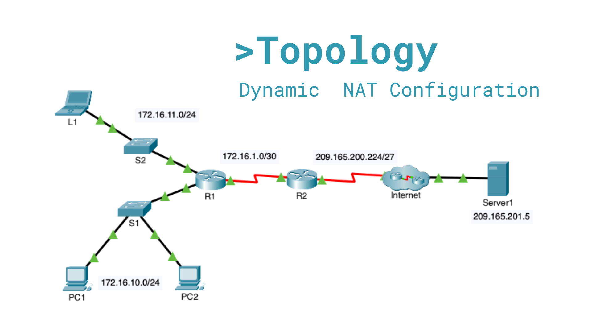

Dynamic NAT Configuration

## Project overview

This Cisco Packet Tracer lab demonstrates **dynamic Network Address Translation (NAT)**. Router R2 translates private addresses from multiple internal networks into a small pool of public IPv4 addresses, allowing internal clients to access a web server on the Internet.

## Topology



| Item | Address / purpose |
| --- | --- |
| Internal client networks | `172.16.0.0/16` |
| R2 inside interface | `Serial0/0/1` |
| R2 outside interface | `Serial0/0/0` |
| Public NAT pool | `209.165.200.229` - `209.165.200.230` |
| Public pool network | `209.165.200.228/30` |
| External web server | `209.165.201.5` |

## Objective

Configure R2 to dynamically translate traffic sourced from the `172.16.0.0/16` private address space. The NAT pool contains two usable public addresses, which are assigned temporarily as internal clients initiate traffic toward the Internet.

## How dynamic NAT works in this lab

An access control list identifies the internal addresses permitted to be translated. The NAT pool provides the public addresses used for translations. Once a client sends traffic outside the network, R2 assigns an available pool address and creates a temporary translation entry.

Unlike static NAT, dynamic NAT does not create a permanent mapping. A pool address remains allocated only while its translation is active.

## Configuration

The following commands were configured on R2:

```cisco
enable
configure terminal

! Permit every host in the 172.16.0.0/16 internal address space
access-list 1 permit 172.16.0.0 0.0.255.255

! Build a pool with the two usable addresses in 209.165.200.228/30
ip nat pool NAT_POOL 209.165.200.229 209.165.200.230 netmask 255.255.255.252

! Associate ACL 1 with the NAT pool
ip nat inside source list 1 pool NAT_POOL

! Identify the interface toward the private networks
interface serial 0/0/1
 ip nat inside
exit

! Identify the interface toward the Internet
interface serial 0/0/0
 ip nat outside
exit

end
copy running-config startup-config
```

## Verification

After configuration, an internal host such as L1, PC1, or PC2 can open the external server web page:

```text
http://209.165.201.5
```

The following commands verify the NAT deployment on R2:

```cisco
show running-config | include nat
show ip nat translations
show ip nat statistics
```

`show ip nat translations` displays the private source address of the active internal client and the public address dynamically assigned from `NAT_POOL`.

## Address-pool limitation

The `209.165.200.228/30` block contains only two usable host addresses: `.229` and `.230`. Therefore, only **two simultaneous dynamic NAT translations** can exist.

If a third internal device attempts to access the Internet while both pool addresses are in use, R2 cannot create another translation and the connection fails. Access can resume when an existing translation expires. NAT overload (PAT) would be required to allow many devices to share one or both public addresses.

## Result

Dynamic NAT was successfully configured on R2. Internal clients in the `172.16.0.0/16` address range can reach the external web server using a temporary public address from the configured NAT pool.

## Skills demonstrated

- Cisco IOS configuration
- Standard ACL configuration with wildcard masks
- Dynamic NAT pool creation and association
- Inside/outside NAT interface configuration
- NAT translation verification and troubleshooting
- IPv4 address planning and /30 subnet analysis
