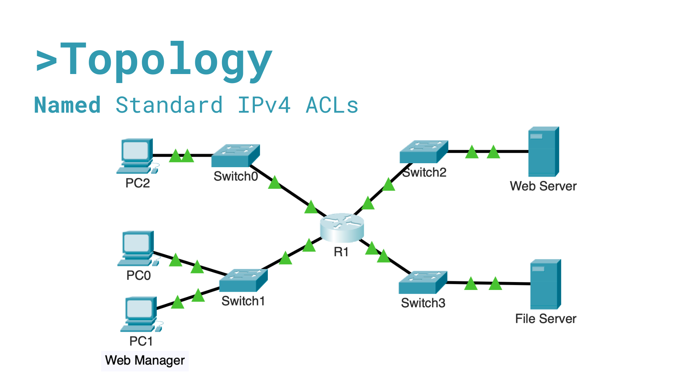

# Named Standard IPv4 ACL Configuration

## Overview

This lab demonstrates the implementation of a Named Standard IPv4 Access Control List (ACL) to protect a File Server in a Cisco Packet Tracer environment.

The objective was to allow access only from an authorized workstation and the Web Server while denying all other hosts.

---

## Skills Demonstrated

- Cisco IOS Configuration
- Named Standard ACLs
- Access Control Policy Enforcement
- Network Security Fundamentals
- Router Interface ACL Application
- ACL Verification and Troubleshooting

---

## Network Topology



---

## Security Requirement

Only the following devices must be allowed to access the File Server:

| Device | IP Address |
|----------|------------|
| PC1 (Web Manager) | 192.168.20.4 |
| Web Server | 192.168.100.100 |

All other devices must be denied access.

---

## ACL Configuration

### Named ACL

```cisco
ip access-list standard File_Server_Restrictions
 permit host 192.168.20.4
 permit host 192.168.100.100
 deny any
```

### ACL Application

```cisco
interface Ethernet0/1/0
 ip access-group File_Server_Restrictions out
```

---

## Verification Tests

### Allowed

| Source | Destination | Result |
|----------|-------------|---------|
| PC1 | File Server | Success |
| Web Server | File Server | Success |

### Blocked

| Source | Destination | Result |
|----------|-------------|---------|
| PC0 | File Server | Blocked |
| PC2 | File Server | Blocked |

### Unaffected Traffic

All hosts successfully maintained access to the Web Server.

---

## Key Takeaways

- Named ACLs are easier to manage than numbered ACLs.
- Standard ACLs filter traffic based only on source IP addresses.
- ACLs should be placed as close as possible to the destination network.
- Explicit permit statements must be configured before deny statements.
- ACL counters help verify policy enforcement.

---

## Technologies Used

- Cisco Packet Tracer
- Cisco IOS
- IPv4 Networking
- Standard ACLs
- Network Security

---


## ACL Verification Summary

A named standard ACL called **File_Server_Restrictions** was successfully created on R1 to restrict access to the File Server. The ACL permits access only from the Web Manager workstation (PC1 - 192.168.20.4) and the Web Server (192.168.100.100), while denying all other traffic.

### ACL Configuration

```cisco
ip access-list standard File_Server_Restrictions
 permit host 192.168.20.4
 permit host 192.168.100.100
 deny any
```

### ACL Verification

```cisco
show access-lists
```

Output:

```cisco
Standard IP access list File_Server_Restrictions
10 permit host 192.168.20.4
20 permit host 192.168.100.100
30 deny any
```

### ACL Application

The ACL was applied outbound on interface Ethernet0/1/0:

```cisco
interface Ethernet0/1/0
 ip access-group File_Server_Restrictions out
```

### Interface Verification

```cisco
show ip interface ethernet 0/1/0
```

Output:

```cisco
Outgoing access list is File_Server_Restrictions
```

### Results

- PC1 (192.168.20.4) successfully accessed the File Server.
- The Web Server (192.168.100.100) successfully accessed the File Server.
- PC0 and PC2 were denied access to the File Server.
- All hosts maintained connectivity to the Web Server.
- The ACL was successfully configured, applied, and verified according to the security requirements of the lab.

## Author

Elmer Chavarría

Cybersecurity Student | Networking Enthusiast
