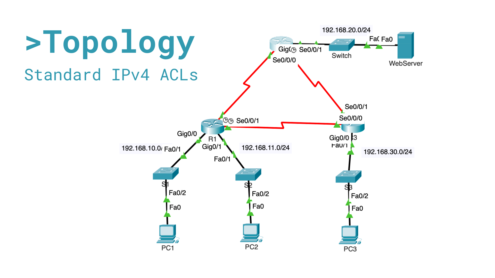

## Network Topology




Configure Standard IPv4 ACLs in Cisco Packet Tracer

## Overview

This lab demonstrates the implementation of numbered Standard IPv4 Access Control Lists (ACLs) using Cisco routers in Packet Tracer.

The objective was to restrict specific network access while allowing all other traffic, following common network security best practices.

## Skills Demonstrated

- Cisco IOS Configuration
- Standard IPv4 ACLs
- Network Security Fundamentals
- Access Control Policies
- EIGRP Routed Networks
- Troubleshooting and Verification
- Packet Tracer Network Simulation

---

## Topology

The network consists of three routers connected through serial links running EIGRP routing.

### LAN Networks

| Network | Purpose |
|----------|----------|
| 192.168.10.0/24 | PC1 LAN |
| 192.168.11.0/24 | PC2 LAN |
| 192.168.20.0/24 | Web Server LAN |
| 192.168.30.0/24 | PC3 LAN |

### WAN Networks

| Network |
|----------|
| 10.1.1.0/30 |
| 10.2.2.0/30 |
| 10.3.3.0/30 |

---

## Security Requirements

### Policy 1

Block traffic originating from:

```text
192.168.11.0/24
```

To:

```text
Web Server Network
192.168.20.0/24
```

Allow all other traffic.

---

### Policy 2

Block traffic originating from:

```text
192.168.10.0/24
```

To:

```text
192.168.30.0/24
```

Allow all other traffic.

---

## Router R2 Configuration

### Create ACL

```cisco
access-list 1 deny 192.168.11.0 0.0.0.255
access-list 1 permit any
```

### Apply ACL

```cisco
interface GigabitEthernet0/0
 ip access-group 1 out
```

### Verification

```cisco
show access-lists
show ip interface g0/0
```

---

## Router R3 Configuration

### Create ACL

```cisco
access-list 1 deny 192.168.10.0 0.0.0.255
access-list 1 permit any
```

### Apply ACL

```cisco
interface GigabitEthernet0/0
 ip access-group 1 out
```

### Verification

```cisco
show access-lists
show ip interface g0/0
```

---

## Connectivity Tests

| Source | Destination | Expected Result |
|----------|-------------|----------------|
| PC1 | PC2 | Allowed |
| PC1 | Web Server | Allowed |
| PC2 | Web Server | Blocked |
| PC1 | PC3 | Blocked |
| PC2 | PC3 | Allowed |
| PC3 | Web Server | Allowed |

---

## Verification Results

ACL counters were used to confirm that traffic matched the correct ACL entries.

Example:

```cisco
R2# show access-lists

Standard IP access list 1

10 deny 192.168.11.0 0.0.0.255
20 permit any
```

```cisco
R3# show access-lists

Standard IP access list 1

10 deny 192.168.10.0 0.0.0.255
20 permit any
```

---

## Key Takeaways

- Standard ACLs filter traffic based only on source IP addresses.
- ACLs should be placed as close as possible to the destination.
- An implicit deny exists at the end of every ACL.
- Verification commands are essential to confirm proper ACL operation.
- ACL counters help validate security policy enforcement.

---

## Technologies Used

- Cisco Packet Tracer
- Cisco IOS
- EIGRP
- IPv4 Routing
- Standard Access Control Lists (ACLs)

---

## Author

**Elmer Chavarría**

Cybersecurity Student | Networking Enthusiast |

Costa Rica
