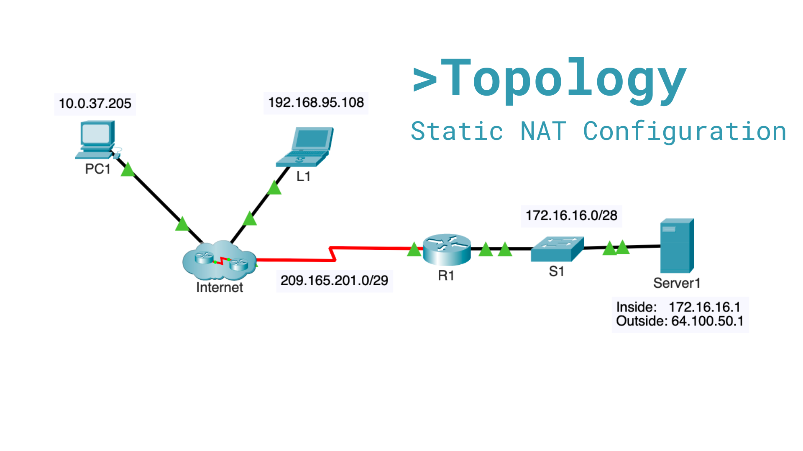

Static NAT Configuration | Cisco Packet Tracer

## Project overview

This lab demonstrates the configuration and validation of **static Network Address Translation (NAT)** on a Cisco router. The objective was to publish an internal web server with a private IPv4 address so that hosts on external networks could access it through a fixed public IPv4 address.



## Lab objective

Configure a one-to-one static NAT translation on **R1** that maps Server1's private address, `172.16.16.1`, to the public address, `64.100.50.1`.

## Network topology

| Device / network | Address or role |
| --- | --- |
| PC1 | `10.0.37.205` (external client) |
| L1 | `192.168.95.108` (external client) |
| R1 Serial0/0/0 | Public/outside interface on `209.165.201.0/29` |
| R1 GigabitEthernet0/0 | Private/inside interface |
| Server1 | `172.16.16.1` (inside local address) |
| Server1 public mapping | `64.100.50.1` (inside global address) |
| Internal LAN | `172.16.16.0/28` |

## Problem statement

Server1 uses a private IPv4 address, which cannot be routed across the Internet. Before NAT was configured, external devices could reach R1's public interface but could not reach Server1 at `172.16.16.1`. Static NAT solves this by associating the server with a permanent, routable public address.

## Configuration

The following configuration was applied on R1:

```cisco
enable
configure terminal

! Create a permanent mapping for Server1
ip nat inside source static 172.16.16.1 64.100.50.1

! Mark the interface facing the private server network
interface gigabitEthernet 0/0
 ip nat inside
exit

! Mark the interface facing the Internet
interface serial 0/0/0
 ip nat outside
exit

end
copy running-config startup-config
```

## Validation

The following commands were used to confirm the configuration and inspect the translation:

```cisco
show ip interface brief
show running-config | include nat
show ip nat translations
show ip nat statistics
```

Expected static translation:

```text
Inside local:  172.16.16.1
Inside global: 64.100.50.1
```

From PC1 or L1, connectivity was tested against the server's **public** address:

```text
ping 64.100.50.1
```

The server web service can then be opened at:

```text
http://64.100.50.1
```

## Result

Static NAT was successfully configured on R1. External clients can access Server1 using `64.100.50.1`, while the server remains on the internal network with the private address `172.16.16.1`.

## Skills demonstrated

- Cisco IOS command-line configuration
- Static NAT (inside local to inside global translation)
- Inside and outside NAT interface designation
- IPv4 connectivity testing with `ping`
- NAT verification and troubleshooting with Cisco IOS show commands
- Basic network documentation with Markdown
